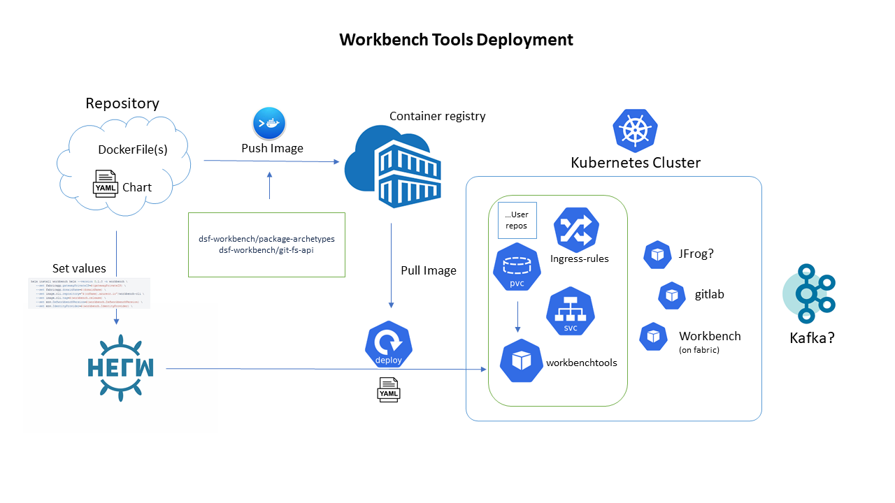

# Workbench GIT FS Service

The dsf-workbenchtools project uses Quarkus Framework.  The service exposes RESTful Web Services to handle GIT & FS actions. 
This application is integrated with Keycloak for authentication & authorization. A GIT provider has to be configured for SCM functionality.


### Installation and running the application on docker desktop

The application can be installed and run in a Docker Container.Pre image is provided which can be loaded into docker container and start it.

Prerequites:

* JDK 11+ installed with JAVA_HOME configured
* Apache Maven 3.8.1+
* Docker Desktop 4.2 + installed

Artifact dsf-workbenchtools-preimage-{version}.zip provided should be extracted into C:/ drive.

WorkbenchTools support two login modes - Basic authentication and OIDC authentication

To deploy dsf-workbenchtools on docker, run the `dsf-workbenchtools-preimage-{version}/dsf-workbenchtools-deploy.bat *` from a command window.

* B - Build dsf-workbenchtools Basic Auth Docker Image and start the dsf-workbenchtools service
* O - Build dsf-workbenchtools OIDC Docker Image and start the dsf-workbenchtools service
* U - Up the container which can be accessed at `http://localhost/wb-tools`
* D - Make the container down


### Installation and running the application on minikube (Kubernetes cluster)

The application can also be installed and run in minikube


Let us consider minikube for our deployment. To start with we need to push the image available in dsf-workbenchtools-{version}.zip to docker as provided above. Post this we have to move the docker image into kubernetes container following the commands given below (commands with respect Azure envionment)

### Build Workbench Tools Image
Build the Workbench Tools Image and push it to the registry after tagging it accordingly 

```sh
cd dsf-workbenchtools

# To build Workbenchtools OIDC docker image 
docker build -f Dockerfile.jvm -t dsf-workbench/wbtools .

# To build Workbenchtools Basic-auth docker image 
docker build -f Dockerfile.basic.jvm -t dsf-workbench/wbtools .

az acr login -n <crname>
docker tag dsf-workbench/wbtools <crname>.azurecr.io/dsf-workbench-wbtools:<tag>
docker push <crname>.azurecr.io/dsf-workbench-wbtools:<tag>
```
### Deploy WorkbenchTools on to a Kubernetes cluster using Helm

Run Helm install to deploy WorkbenchTools by setting the appropriate values

```sh
helm install workbenchtools -f helm/vaules-azure.yaml --kube-context $INSTANCE_CLUSTER_NAME \

   --set image.repository="$(crName).azurecr.io"/dsf-workbench-wbtools \
   --set image.tag=$(workbenchtools.release) \
   --set env.saasWorkbenchInstance=$(workbenchtools.saasWorkbenchInstance) \
   --set env.saasWorkbenchBlueprint=$(workbenchtools.saasWorkbenchBlueprint) \
   --set env.wbToolsConfigProfile=$(workbenchtools.wbToolsConfigProfile) \
   --set env.wbToolsConfigProvider=$(workbenchtools.wbToolsConfigProvider) \
   --set env.authProvider=$(workbenchtools.authProvider) \
   --set env.oidcAuthServerUrl=$(workbenchtools.oidcAuthServerUrl) \
   --set env.oidcClientId=$(workbenchtools.oidcClientId) \
   --set env.gitProvider=$(workbenchtools.gitProvider) \
   --set env.gitServerUrl=$(workbenchtools.gitServerUrl) \
   --set env.gitProject=$(workbenchtools.gitProject) \
   --set env.gitRepository=$(workbenchtools.gitRepository) \
   --set env.gitAdminAccessToken=$(workbenchtools.gitAdminAccessToken) \
   --set env.gitRepoRoot=$(workbenchtools.gitRepoRoot) \
   --set env.repoProvider=$(workbenchtools.repoProvider) \
   --set env.artifactoryBaseUrl=$(workbenchtools.artifactoryBaseUrl) \
   --set env.artifactoryKey=$(workbenchtools.artifactoryKey) \
   --set env.tenantArtifactoryRepo=$(workbenchtools.tenantArtifactoryRepo) \
   --set env.kafkaBootstrapServers=$(workbenchtools.kafkaBootstrapServers) \
   --set env.notificationProvider=$(workbenchtools.notificationProvider) \
   --set env.kafkaProducerTopic=$(workbenchtools.kafkaProducerTopic) \
   --set env.kafkaProducerPassword=$(workbenchtools.kafkaProducerPassword) \
   --set fileShare.StorageAccount=$(workbenchtools.StorageAccount) \
   --set fileShare.StorageKey=$(workbenchtools.StorageKey) \
   --create-namespace --wait --timeout 10m0s
```

## End Points

* `http://localhost/wb-tools/swagger` will let you download the swagger.json which can imported to Rest Clients like Postman or Insomnia
* `http://localhost/wb-tools/swagger-ui` - Access the Open API swagger UI
* `http://localhost/wb-tools/health` to know the health of the service
* `http://localhost/wb-tools/api/v1.0.0` REST end points 

